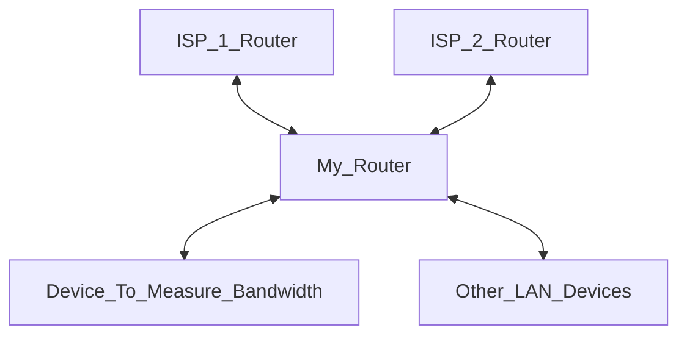

## [NetworkSpeed_Log](/Measure-NetworkSpeed.sh)
    Script to measure network bandwith and place in a CSV file dedicated for each month.
    Script is capable to detect which Network is used in Failover load balancing scenarios. 
    
    The output file will be saved in the following directory structure visible below:
    .
    ├── GatewayNames.txt [Configuration file]
    ├── Measure-NetworkSpeed.sh 
    └── Output 
        └── [Year when bandwidth was measured]
            └── [Output file name in format: YYYY-mmm]
    
    The structure will be created on the first time of the script.

    Speedtest is done using Speedtest® by Ookla® (https://www.speedtest.net/pl/apps/cli)
        Month
        Timestamp                                    
        ISP
        Local Gateway IP
        server name
        idle latency [ms]
        idle jitter [ms]
        packet loss [%]
        download [Mbps]
        download latency [ms]
        upload [Mbps]
        upload latency [ms]
        download bytes
        upload bytes
        share url

# How to configure
1. The first line is the indicator on which route in tracert the Gateway will appear in order to detect which ISP is in use:

        EXTERNAL_GATEWAY_NUMBER: [Traceroute_line_to_check]

2. Next you need to place the list of your ISPs with the name and the IP which clearly define them in format:

        IP:"Gateway_IP_1" NAME:"ISP_1"
        IP:"Gateway_IP_2" NAME:"ISP_2"

    You can put as many ISPs as you want, all of the will be considered on selected traceroute level,

3. Remember to leave blank line at the end of the configuration file.

## Real scenario case

As you can see if we run traceroute from "Device_To_Measure_Bandwidth" to any public IP on the **first** output line from we will see the IP address of our "My_Router", the next one will be "ISP_1_Router" or "ISP_2_Router".

That's why in this scenario: 

    EXTERNAL_GATEWAY_NUMBER: 2

Should be set to 2, as we want to check the **second** route in the traceroute.

Sample configuration [file](/GatewayNames.txt) based on the diagram above:

    EXTERNAL_GATEWAY_NUMBER: 2
    IP:10.0.0.1 NAME:ISP_1_Router
    IP:10.0.0.2 NAME:ISP_2_Router
    [blank_line]

Script has 1 input parameter based on which the result of the measurement is displayed in the console or not. This parameter will not change anything in the CSV file which is always saved or appended in the same format. If you want to skip displaying results in the consloe run the script with **the first** positional parameter set to:

    false
As result complete command to run the scipt without console output is:

    ./Measure-NetworkSpeed.sh false

Otherwise run the script without any positional parameter

    ./Measure-NetworkSpeed.sh

